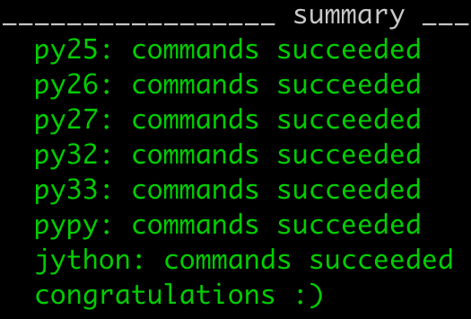
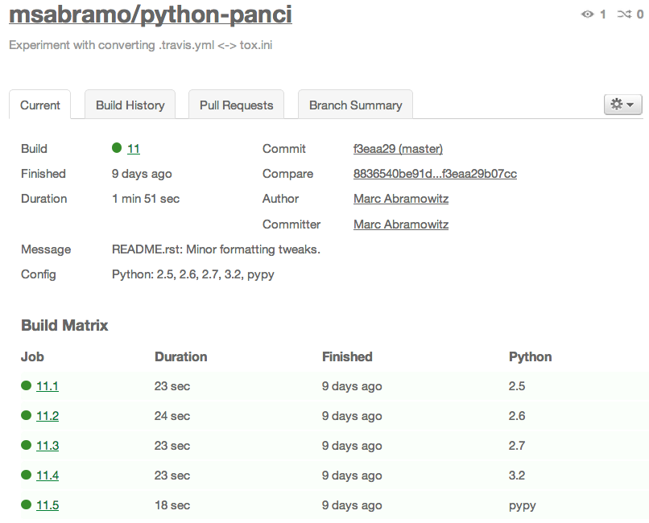
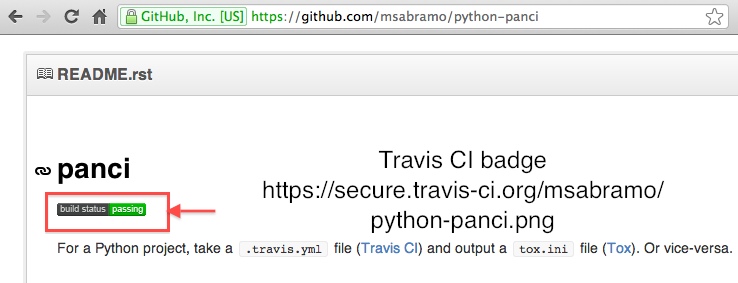

<!SLIDE smaller intro title-slide>

# Making Projects Work With Multiple Versions of Python

## [Marc Abramowitz](http://marc-abramowitz.com/)
## [http://marc-abramowitz.com/](http://marc-abramowitz.com/)
## [@msabramo](https://twitter.com/MSAbramo)
## [marc@marc-abramowitz.com](mailto:marc@marc-abramowitz.com?subject=Multi Python Presentation)
## [http://msabramo.github.com/multi-python-preso/](http://msabramo.github.com/multi-python-preso/)
## [http://github.com/msabramo/multi-python-preso](http://github.com/msabramo/multi-python-preso)

<!SLIDE>

# About this talk

* About 40 minutes of material
* Proposal submitted to give this talk at PyCon US 2013 in March
	* [https://us.pycon.org/2013/proposals/147/](https://us.pycon.org/2013/proposals/147/)
* Let's try taking questions throughout

<!SLIDE>

# Outline

* Targeting multiple pythons: the problem
* Testing against multiple pythons
	* Tox
	* Travis CI
* Multi-Python Compatibility Approaches
	* Translation tools (e.g.: `2to3`, distribute's `use_2to3`)
	* Python 2/3 Compatible Source (possibly with help from `six`)

<!SLIDE>

# Problem: Multiple Pythons

* 2.4, 2.5, 2.6, 2.7
* 3.0, 3.1, 3.2, 3.3
* PyPy
* Jython

<!SLIDE>

# Differences in Python 2.x versions

* `with` statement (2.5)
* `except...as` syntax (2.6)
* `unittest` (2.7)

<!SLIDE>

# Differences between Python 2.x and Python 3.x

.notes even more dramatic differences

* `print` **statement** vs. `print` **function**
* Unicode handling
	* `str` and `unicode` vs. `bytes` and `str`
	* `u` and `b` syntax for string literals
* Moved classes and renamed modules
	* `httplib` => `http.client`
	* `StringIO.StringIO` => `io.StringIO`

<!SLIDE small>

# Why is compatibility important?

* A lot of Pythons out there in the wild from 2.4 to 3.3
	* Want to make libraries support as many as possible and practical, so they have wide audience.
* The Python 2 vs. 3 divide
	* Python 3 is the future. All core work happening in 3.
	* But lots of stuff still using Python 2 because other stuff not supporting Python 3.

<!SLIDE section>

# Testing against multiple Pythons

<!SLIDE>

# Goal

* Be able to quickly know whether code works in various versions of Python

<!SLIDE section>

# Tox

<!SLIDE>

# Tox

* By Holger Kregel ([`py.test`](http://pytest.org/), [`execnet`](http://codespeak.net/execnet/))
* [http://tox.testrun.org/](http://tox.testrun.org/)
* `pip install tox`

<!SLIDE>

# Tox

* A virtualenv manager
* Tests your stuff in multiple Pythons using `virtualenv`
* Everything happens **locally**

<!SLIDE>

# Using Tox

* Prerequisites
	* Install pythons
	* Create `setup.py` for project
* Create a `tox.ini` file
* Run `tox`

.notes Pythons can be installed manually or you can use something like pythonbrew, but it's your responsibility.
This is in constrast to Travis CI, which we will see in a bit...

<!SLIDE>

# Tox.ini

* A `.ini` file
* Main sections are:
	* `tox`
	* `testenv`

<!SLIDE>

# Tox.ini

    [tox]
    envlist = py26, py27, py32, py33, pypy
    
    [testenv]
    commands = nosetests

<!SLIDE>

# Run Tox

* Execute `tox` in project root directory.

<!SLIDE center>

# Congratulations!

<!SLIDE smaller>

# Other Tox features
 
* `tox -e py32,py33`
* `deplist` - specify packages needed
* environment-specific sections
	* e.g.: `[testenv:py26]`
* variable substitutions, pseudo-inheritance
	* e.g.: allows some environments to have extra dependencies

.notes `deplist` overlaps with putting dependencies in `setup.py`, but useful for putting test-only dependencies

<!SLIDE section>

# Travis CI

<!SLIDE>

# Travis CI

* [http://about.travis-ci.org/](http://about.travis-ci.org/)
* CI in the cloud, via virtual machines
* You don't install Pythons
* Triggered by **GitHub** service hooks
* Free and open-source
* Language-agnostic

.notes Languages are C, C++, Clojure, Erlang, Go, Groovy, Haskell, Java, JavaScript (with Node.js), Perl, PHP, Python, Ruby, Scala

<!SLIDE>

# Travis CI Environment is Rich

* gcc, clang, make, autotools, apt-get
* MySQL, PostgreSQL, MongoDB, Redis, RabbitMQ, ZeroMQ, ElasticSearch, etc.
* PhantomJS, xvfb, Firefox
* Allows doing a lot of forms of testing

.notes Environments include several versions of Python and a host of build tools, data stores, messaging software, etc. which can be useful for testing. Details at [http://about.travis-ci.org/docs/user/ci-environment/](http://about.travis-ci.org/docs/user/ci-environment/), [http://about.travis-ci.org/docs/user/database-setup/](http://about.travis-ci.org/docs/user/database-setup/), and [http://about.travis-ci.org/docs/user/gui-and-headless-browsers/](http://about.travis-ci.org/docs/user/gui-and-headless-browsers/)

<!SLIDE>

# Setting up Travis CI

* Set up GitHub service hook
	* Sign into Travis CI with GitHub
	* Pick which repos to enable for Travis CI
* Create `.travis.yml`
* Commit, push, test

<!SLIDE>

# Sample `.travis.yml`

	language: python

	python:
	  - 2.5
	  - 2.6
	  - 2.7
	  - 3.2
	  - pypy

	install: python setup.py install

	script: python setup.py test

<!SLIDE>

# Push to test

* `git push`
* Watch the Web UI
* Or wait for notification via email or IRC

<!SLIDE center smaller>

Travis CI Build Result Page

<!SLIDE center smaller>

# Travis CI Build Badge Image

<!SLIDE>

# Travis CI for pull requests

* Travis CI also has the ability to automatically run tests on incoming pull requests
* Great for repo owner to see whether the PR passes tests.

<!SLIDE>

# Tox vs. Travis CI

* Which one? Or both?

<!SLIDE>

# Tox

* locally run
* requires more setup
* faster feedback loop
* can test before committing

<!SLIDE>

# Travis CI

* cloud-based
* less setup
* uses virtual machines = more isolated
* slower feedback loop - have to push and sometimes wait in queue

<!SLIDE>

# ...Or use both

* You can use both to get advantages of both
* Disadvantage: more files to maintain

.notes annoying to maintain dependencies in setup.py, requirements.txt, tox.ini, and .travis.yml; mention panci & travis2tox & tox2travis...?

<!SLIDE>

# Panci

* Experimental tool for converting between CI file formats
	* tox-quickstart
	* Tox to Travis CI
	* Travis CI to Tox
* [https://github.com/msabramo/python-panci](https://github.com/msabramo/python-panci)

<!SLIDE section>

# Multi-Python Compatibility
## with an emphasis on Python 2/3 compatibility

.notes Especially focused on Python 2 vs. Python 3

<!SLIDE>

# Python3Porting.com

* Lennart Regebro
* Porting to Python 3
* Book (no longer in print) and [web site](http://python3porting.com)
* Tons of tips for dealing with porting situations

.notes Picture of Python3Porting.com?
.notes Migration strategies
Preparing for Python 3
Porting with 2to3
Common migration problems
Improving your code with modern idioms
Supporting Python 2 and 3 without 2to3 conversion
Migrating C extensions
Extending 2to3 with your own fixers
Language differences and workarounds
Reorganizations and renamings

<!SLIDE>

# 2 vs. 3

* Handling `str` and `unicode` vs. `bytes` and `str`
* Literal notation like `u''` and `b''`
* Moved classes and modules. 
	* `StringIO.StringIO` => `io.StringIO`
	* `xrange` => `range`
	* `httplib` => `http.client`

.notes `u` syntax for string literals removed in Python 3 but added back in Python 3.3 ([PEP 0414](http://www.python.org/dev/peps/pep-0414/))

<!SLIDE>

# Approaches

* Use tools for testing - Tox and Travis CI
* Leverage translation tools like `2to3`, `3to2`, etc.
* Python 2/3 Compatible Source

<!SLIDE>

# Strategies - tradeoffs

* Translation tools
	* Sort of a crutch.
	* Prevent you from using new features - e.g.: Python 3's unicode handling.
* Python 2/3 Compatible Source
	* Can sometimes get a bit ugly.
	* Libraries like `six` can help.

<!SLIDE small>

# Translation: `2to3`

* CLI tool that comes with recent Pythons
* Translates from Python 2 to 3
* But then it doesn't work in Python 2
* `3to2` (3rd party)
* Running these tools manually encourages forking and having separate Python 2 and 3 codebases. Yuck. 
* python's `-3` option: find problems before running `2to3`

<!SLIDE>

# Translation: distribute's `use_2to3` feature

* Put `use_2to3=True` in `setup.py`
* Translates **on the fly** when user does `python setup.py install`.
* Leverages `2to3` but runs automatically at **install-time**.
* Developer maintains only one code base.

<!SLIDE>

# Example Python 2/3 Compatible Source (1)

	@@@python
    try:
        # Python 2
        unicode
    except NameError:
        # Python 3
    	unicode = str

<!SLIDE>

# Example Python 2/3 Compatible Source (2)

	@@@python
	try:
		# Python 2
	    from StringIO import StringIO
	except ImportError:
		# Python 3
	    from io import StringIO

	s = StringIO()

<!SLIDE>

# This can get a big ugly...

<!SLIDE>

# The `six` module

* Python 2 and 3 compatibility library
* by Benjamin Peterson (Python core dev)
* [http://pypi.python.org/pypi/six/](http://pypi.python.org/pypi/six/)
* `pip install six`
* Has lots of abstractions for things that differ

<!SLIDE>

# Using `six`

	@@@python
	from six import u, b

	print(u('Bj\xf6rk Gu\xf0mundsd\xf3ttir'))

<!SLIDE>

# Using `six`

	@@@python
	from six import StringIO

	s = StringIO()

<!SLIDE>

# `six` makes writing Python 2/3 compatible source easier

<!SLIDE small>

# Django 1.5 is using `six` to achieve Python 2/3 compatible source

## [https://www.djangoproject.com/weblog/2012/aug/19/experimental-python-3-support/](https://www.djangoproject.com/weblog/2012/aug/19/experimental-python-3-support/)

<!SLIDE>

# Test!

* Whatever strategy you use...
* Test across multiple Python versions with Tox and/or Travis CI.

<!SLIDE>

# Conclusion

* Targeting multiple pythons: the problem
* Testing against multiple pythons
	* Tox
	* Travis CI
* Multi-Python Compatibility Approaches
	* Translation tools
	* Python 2/3 Compatible Source

<!SLIDE smaller>

# Resources

* [Porting to Python 3 (Lennart Regebro)](http://python3porting.com/)
* [Porting Python 2 Code to Python 3 (Brett Cannon)](http://docs.python.org/3/howto/pyporting.html)
* [zzzeek's Guide to Python 3 Porting (Mike Bayer)](http://techspot.zzzeek.org/2011/01/24/zzzeek-s-guide-to-python-3-porting/)
* [Porting to Python 3 — A Guide (Armin Ronacher)](http://lucumr.pocoo.org/2010/2/11/porting-to-python-3-a-guide/)
* [Writing Forwards Compatible Python Code (Armin Ronacher)](http://lucumr.pocoo.org/2011/1/22/forwards-compatible-python/)
* [Porting Python Code to 3.0 (wiki.python.org)](http://wiki.python.org/moin/PortingPythonToPy3k)
* [python-panci](https://github.com/msabramo/python-panci)
* [Tox-QuickStart PR](https://bitbucket.org/hpk42/tox/pull-request/20/add-a-tox-quickstart-command/diff)
* [Experimental Python 3 support (Django)](https://www.djangoproject.com/weblog/2012/aug/19/experimental-python-3-support/)

<!SLIDE>

# Liked this talk?

* Proposal submitted to give this talk at [PyCon US 2013](http://us.pycon.org/2013/) in March
	* [https://us.pycon.org/2013/proposals/147/](https://us.pycon.org/2013/proposals/147/)
* Think this would be a good talk for [PyCon](http://us.pycon.org/2013/)?
* Tweet to [@pycon](https://twitter.com/pycon) and tell them that you liked talk proposal 147.

<!SLIDE smaller intro>

# Questions?

## [Marc Abramowitz](http://marc-abramowitz.com/)
## [http://marc-abramowitz.com/](http://marc-abramowitz.com/)
## [@msabramo](https://twitter.com/MSAbramo)
## [marc@marc-abramowitz.com](mailto:marc@marc-abramowitz.com?subject=Multi Python Presentation)
## [http://msabramo.github.com/multi-python-preso/](http://msabramo.github.com/multi-python-preso/)
## [http://github.com/msabramo/multi-python-preso](http://github.com/msabramo/multi-python-preso)
